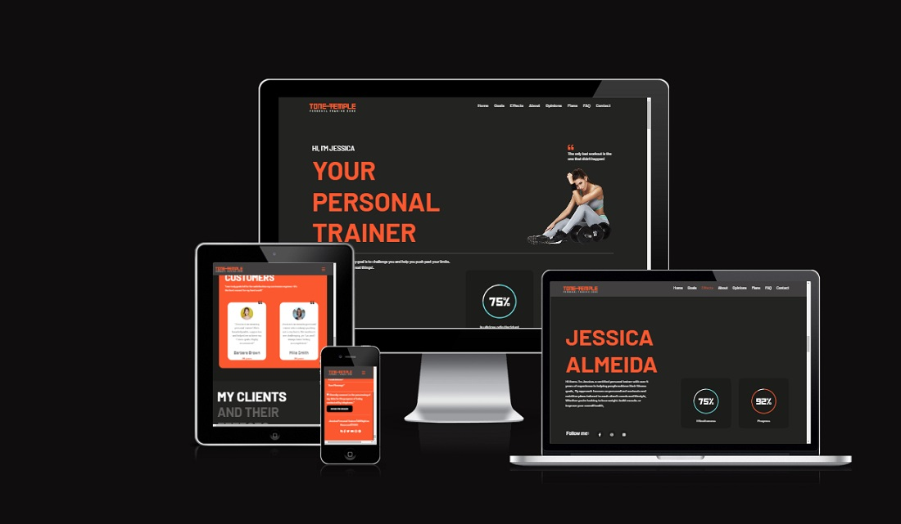

# PERSONAL TRAINER TEMPLATE

Building a website requires more than just creativity and design skills. It also involves technical know-how and the ability to work with various tools and technologies. In this case, HTML, CSS, Javascript, and Bootstrap were used to create a template for the website, while Canva and Photopea were utilized for the design.

One of the most exciting parts of this project was the challenge of building some of the website's unique features, such as the responsive navbar. A responsive navbar is a must-have for any website, as it ensures that the website's menu is accessible and easy to use, regardless of the device being used.

Jquery provides a wide range of functions and methods that can be used to perform various tasks, such as manipulating the DOM and handling events. These features were particularly useful in building the website's interactive elements, such as smooth scrolling, a collapsible Navbar Toggler menu, and a Navbar styled on scrolling.

Jquery played a crucial role in making the project more manageable and efficient. With its wide range of features and easy-to-use syntax, it allowed for the creation of complex features with much less code. As a result, the website was able to run smoothly and seamlessly, providing a great user experience for visitors.

[Live Project Here](https://personal-trainer-template.netlify.app/)

